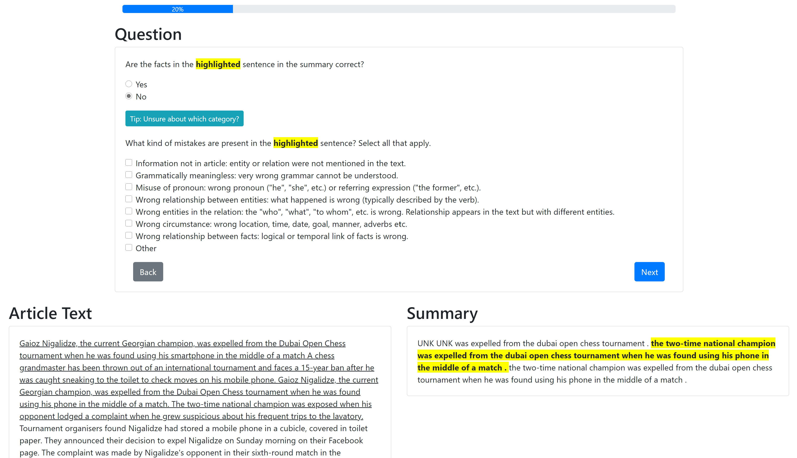
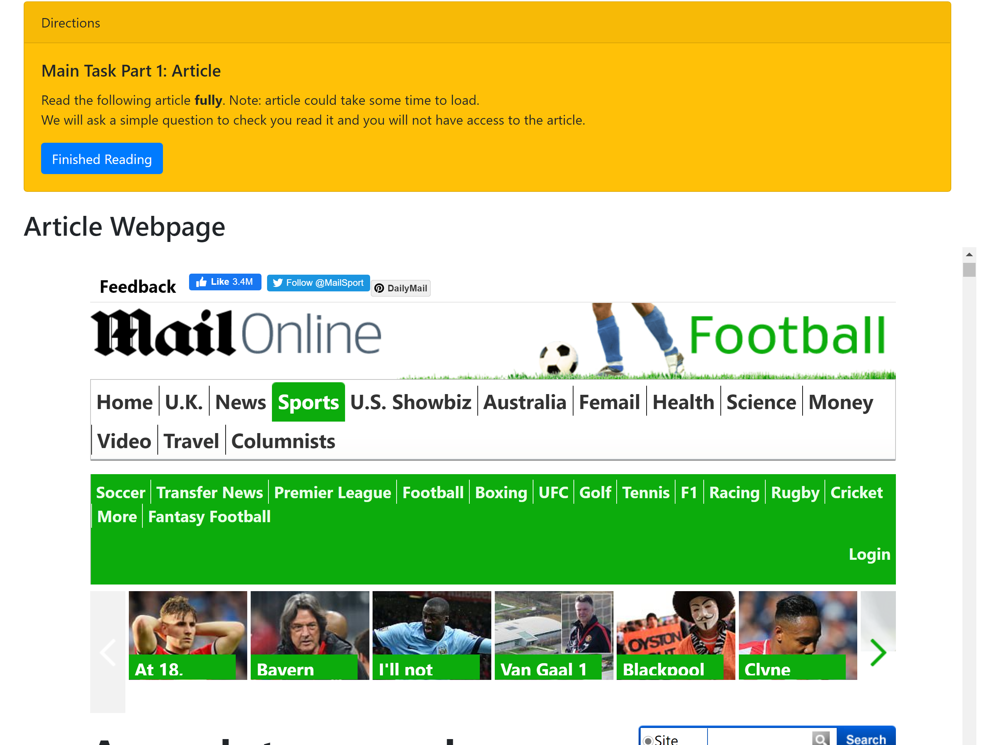

# Frank Annotation Platform
Annotation platform for Amazon Mechanical Turk using external question. 
The annotation task and dataset are described in [our NAACL'21 paper](https://www.aclweb.org/anthology/2021.naacl-main.383/). The dataset resulting from the annotation is available at: https://github.com/artidoro/frank. If you have any questions about using this human annotation tool feel free to open an issue or contact me.

Interface Preview 1    |     Interface Preview 2
-------------------------|-------------------------
 | 

## Citation
```
@inproceedings{pagnoni-etal-2021-understanding,
    title = "Understanding Factuality in Abstractive Summarization with {FRANK}: A Benchmark for Factuality Metrics",
    author = "Pagnoni, Artidoro  and
      Balachandran, Vidhisha  and
      Tsvetkov, Yulia",
    booktitle = "Proceedings of the 2021 Conference of the North American Chapter of the Association for Computational Linguistics: Human Language Technologies",
    month = jun,
    year = "2021",
    address = "Online",
    publisher = "Association for Computational Linguistics",
    url = "https://www.aclweb.org/anthology/2021.naacl-main.383",
    doi = "10.18653/v1/2021.naacl-main.383",
    pages = "4812--4829",
    abstract = "Modern summarization models generate highly fluent but often factually unreliable outputs. This motivated a surge of metrics attempting to measure the factuality of automatically generated summaries. Due to the lack of common benchmarks, these metrics cannot be compared. Moreover, all these methods treat factuality as a binary concept and fail to provide deeper insights on the kinds of inconsistencies made by different systems. To address these limitations, we devise a typology of factual errors and use it to collect human annotations of generated summaries from state-of-the-art summarization systems for the CNN/DM and XSum datasets. Through these annotations we identify the proportion of different categories of factual errors and benchmark factuality metrics, showing their correlation with human judgement as well as their specific strengths and weaknesses.",
}

```

## Annotation Protocol
1. Qualification Test
2. Tutorial
3. Easy to understand instructions (little linguistic terminology)
4. Reading test to verify the annotator read the article before beginning the annotation task
5. Poisoning of the data to ensure to verify the performance of the annotator during the annotation process
6. Identification of relevant passages based on n-gram overlap and highlighting


## Hosting
The website and database were hosted on Firebase

## Framework
The platoform is written in REACT.


# Usage
This project was bootstrapped with [Create React App](https://github.com/facebook/create-react-app).

## Available Scripts

In the project directory, you can run:

### Installing dependencies
delete `package-lock.json`, then run `npm install`


### `npm start`

Runs the app in the development mode.<br />
Open [http://localhost:3000](http://localhost:3000) to view it in the browser.

The page will reload if you make edits.<br />
You will also see any lint errors in the console.

### `npm test`

Launches the test runner in the interactive watch mode.<br />
See the section about [running tests](https://facebook.github.io/create-react-app/docs/running-tests) for more information.

### `npm run build`

Builds the app for production to the `build` folder.<br />
It correctly bundles React in production mode and optimizes the build for the best performance.

The build is minified and the filenames include the hashes.<br />
Your app is ready to be deployed!

See the section about [deployment](https://facebook.github.io/create-react-app/docs/deployment) for more information.

## Learn More

You can learn more in the [Create React App documentation](https://facebook.github.io/create-react-app/docs/getting-started).

To learn React, check out the [React documentation](https://reactjs.org/).

### Deploy to firebase `firebase deploy`

The public repo is `build`.
